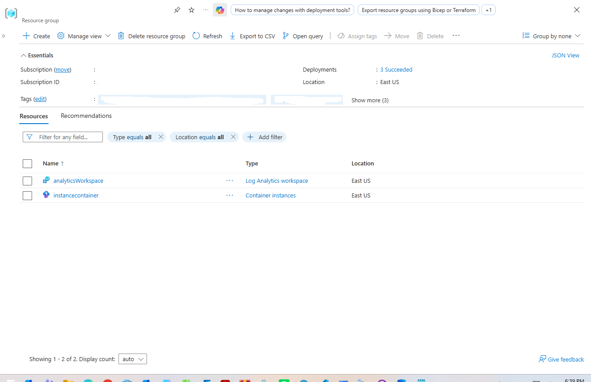
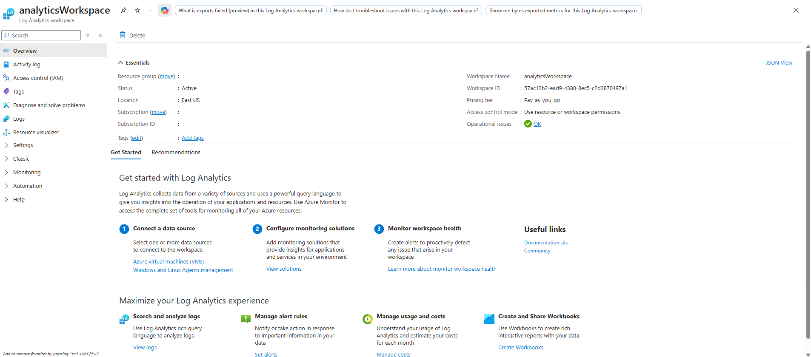
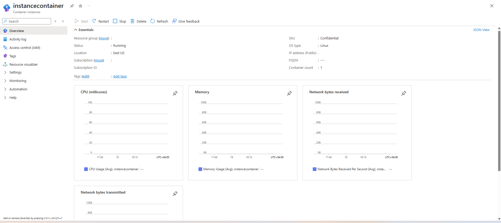
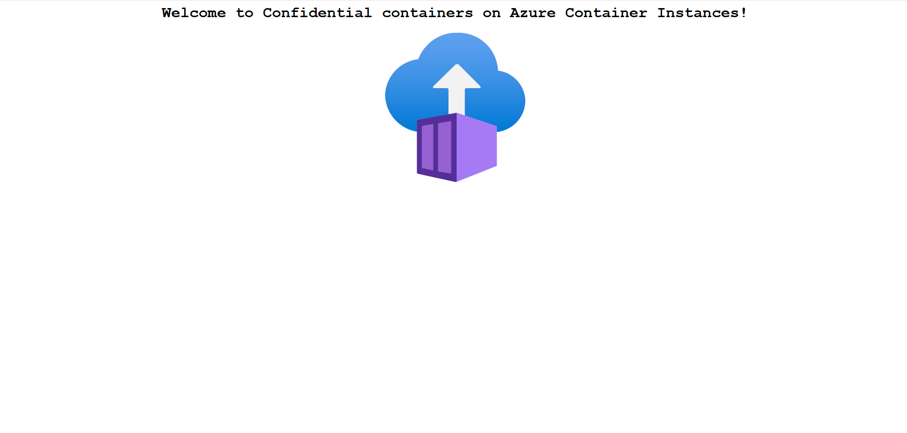

# Confidential Container Deployment on Azure Container Instances (ACI) 

A step-by-step implementation detailing the deployment, confidential computing enforcement, diagnostic monitoring, and verification of a confidential container group on Azure Container Instances using the Azure Portal.

---

## 1. Architecture & Provisioned Resources

All infrastructure was created in the East US region under resource group lab-11500-2297488-de370781:

* Container group: instancecontainer - Confidential SKU running Linux, provisioned with 1 vCPU, 1.5 GB memory, public IP 20.75.147.247 on port 80, hardware-isolated via Confidential Computing Enforcement (CCE) security policy
* Container image: mcr.microsoft.com/aci/aci-confidential-helloworld:v1 - Sample workload serving a confidential container verification landing page
* Monitoring workspace: analyticsWorkspace - Pay-as-you-go Log Analytics workspace configured with 30-day retention to collect ContainerInstanceLogs and platform metrics

*Resource group overview showing analyticsWorkspace and instancecontainer.*

---

## 2. Step-by-Step Implementation

### Step 1: Provision Log Analytics Workspace

Configured a central telemetry and diagnostics sink prior to container deployment:

1. Navigated to Log Analytics workspaces in the Azure Portal.
2. Created analyticsWorkspace under resource group lab-11500-2297488-de370781 in the East US region.
3. Verified operational status OK and active state for log ingestion.

*Reviewing the essentials, workspace ID, and operational state of analyticsWorkspace.*

---

### Step 2: Deploy Confidential Container Group

Provisioned the container instance with hardware-level memory encryption and isolation:

1. Navigated to Container instances and initiated container group creation for instancecontainer.
2. Selected the Confidential SKU with Linux OS type and configured resource requests for 1 CPU and 1.5 GB memory.
3. Specified image mcr.microsoft.com/aci/aci-confidential-helloworld:v1 with public port 80 exposure.
4. Attached diagnostic settings linking container runtime logs directly to analyticsWorkspace.
5. Deployed the container group and verified Running status and Succeeded provisioning state.

*Inspecting instancecontainer essentials, confidential SKU confirmation, and assigned public IP.*

---

### Step 3: Validate Confidential Workload Accessibility

Verified the running application over public web traffic:

1. Retrieved the assigned public IP address (20.75.147.247) from instancecontainer overview.
2. Navigated to http://20.75.147.247 on port 80 in a web browser.
3. Confirmed successful rendering of the "Welcome to Confidential containers on Azure Container Instances!" page.

*Browser confirmation of the active confidential container web application.*

